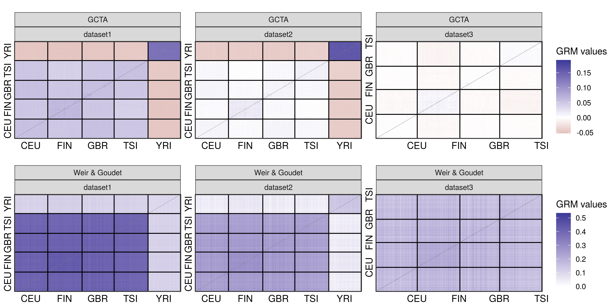

```{r setup, include=FALSE}
library(knitr)
opts_chunk$set(echo = TRUE)
```

## Genotypes

### Input data

- 1000 Genomes Project Phase III, lifted over to GRCh38 coordinates

### Subsets

- Dataset 1: All 2,504 individuals, selecting the 445 Geuvadis individuals after all data filtering;
- Dataset 2: 445 individuals in Geuvadis from EUR and YRI populations;
- Dataset 3: 358 individuals in Geuvadis from EUR populations (CEU, FIN, GBR, TSI).

### VCF processing

- Filters:
    - MAF threshold: 1%
    - Exclude variants with any missing genotype
    - Exclude variants exceding Hardy-Weinberg pvalue = 0.001

- Pruning:
    - Performed with the `SNPRelate::snpgdsLDpruning` function;
    - Method: correlation;
    - LD threshold: square root of 0.1.
    
- Total of final variants:
    - Dataset 1: 682,806
    - Dataset 2: 613,312
    - Dataset 3: 487,536

For each subset above, VCF files were processed by the corresponding "process_genotypes.sh" script in the `./scripts` directory. For example, when selecting the 445 Geuvadis individuals:

```{bash, eval=FALSE, code = readLines("./scripts/process_genotypes_geuv.sh")}
```

### PCA

```{r pca, echo = FALSE}
include_graphics("./plots/pca.png")
```

### GRMs

#### Diagonal values

```{r grm_diag, echo = FALSE}
include_graphics("./plots/grm_diag.png")
```

#### Off-Diagonal values

```{r grm_off, echo = FALSE}

```


