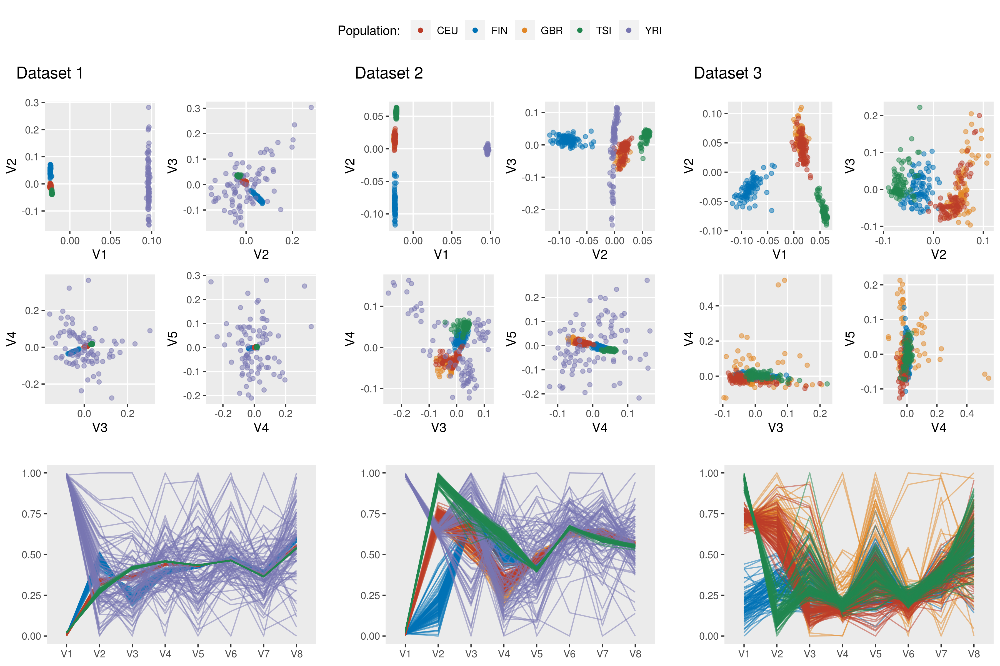
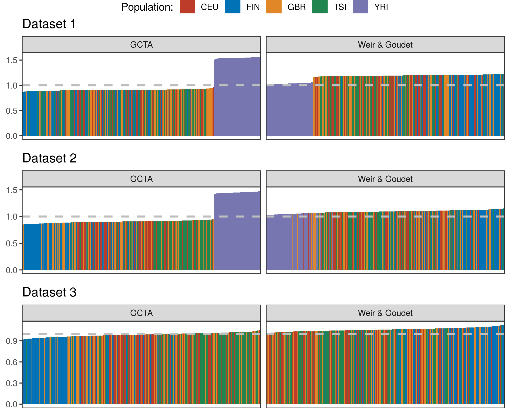
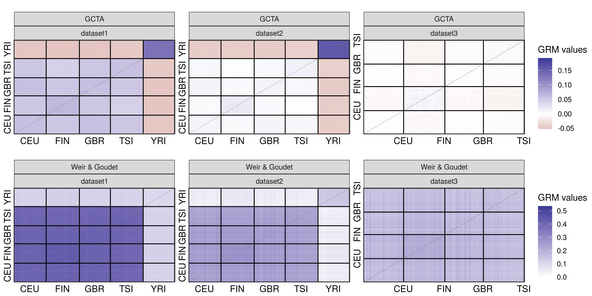

README
================

## Genotypes

### Input data

  - 1000 Genomes Project Phase III, lifted over to GRCh38 coordinates

### Subsets

  - Dataset 1: All 2,504 individuals, selecting the 445 Geuvadis
    individuals after all data filtering;
  - Dataset 2: 445 individuals in Geuvadis from EUR and YRI populations;
  - Dataset 3: 358 individuals in Geuvadis from EUR populations (CEU,
    FIN, GBR, TSI).

### VCF processing

  - Filters:
      - MAF threshold: 1%
      - Exclude variants with any missing genotype
      - Exclude variants exceding Hardy-Weinberg pvalue = 0.001
  - Pruning:
      - Performed with the `SNPRelate::snpgdsLDpruning` function;
      - Method: correlation;
      - LD threshold: square root of 0.1.
  - Total of final variants:
      - Dataset 1: 682,806
      - Dataset 2: 613,312
      - Dataset 3: 487,536

For each subset above, VCF files were processed by the corresponding
“process\_genotypes.sh” script in the `./scripts` directory. For
example, when selecting the 445 Geuvadis individuals:

``` bash
#!/bin/bash

#PBS -l nodes=1:ppn=1
#PBS -l mem=24gb
#PBS -l walltime=24:00:00
#PBS -q short
#PBS -t 1-22
#PBS -N processVCF
#PBS -j oe
#PBS -o /home/vitor/heritability-hla-expression/log/$PBS_JOBNAME

CHR=$PBS_ARRAYID
SAMPLES=/home/vitor/heritability-hla-expression/data/ids_geuvadis.txt
VCFIN=/raid/genevol/vcf_1000G/phase3_20130502_grch38positions/ALL.chr${CHR}_GRCh38.genotypes.20170504.vcf.gz
VCFOUT=/scratch/vitor/chr${CHR}_geuv.vcf
GDS=/scratch/vitor/chr${CHR}_geuv.gds 
SCRIPTS=/home/vitor/heritability-hla-expression/scripts

bcftools view --samples-file $SAMPLES --force-samples $VCFIN |\
    bcftools view --genotype ^miss - |\
    bcftools view --min-af 0.01:minor - |\
    vcftools --vcf - --hwe 0.001 --recode --recode-INFO-all --stdout |\
    bcftools norm -m +both -o $VCFOUT -

Rscript $SCRIPTS/vcf2gds.R $VCFOUT $GDS 
rm $VCFOUT

Rscript $SCRIPTS/prune.R $GDS
```

### PCA

<!-- -->

### GRMs

#### Diagonal values

<!-- -->

#### Off-Diagonal values

<!-- -->
