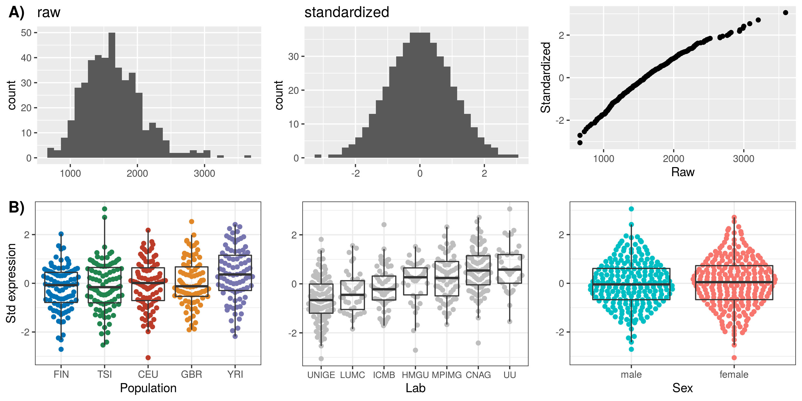

Heritability of the HLA expression
================

## Genotypes

### Input data

  - 1000 Genomes Project Phase III, lifted over to GRCh38 coordinates

### Subsets

  - Dataset 1: All 2,504 individuals, selecting the 445 Geuvadis
    individuals after all data filtering;
  - Dataset 2: 445 individuals in Geuvadis from EUR and YRI populations;
  - Dataset 3: 358 individuals in Geuvadis from EUR populations (CEU,
    FIN, GBR, TSI).

### VCF processing

  - Filters:
      - MAF threshold: 1%
      - Exclude variants with any missing genotype
      - Exclude variants with HWE p-value \< 5x10^-8
  - Pruning:
      - Performed with the `SNPRelate::snpgdsLDpruning` function;
      - Method: correlation;
      - LD threshold: square root of 0.1.
  - Total of final variants:
      - Dataset 1: 738,574
      - Dataset 2: 624,797
      - Dataset 3: 498,533

For each subset above, VCF files were processed by the
“process\_genotypes.sh” scripts in the `./scripts` directory.

### PCA

<!-- -->

### GRMs

#### Diagonal values

<!-- -->

#### Off-Diagonal values

<!-- -->

For the analyses below, we will use Dataset 3 (Europeans), and the GCTA
GRM.

## Phenotypes (HLA-A gene expression)

We used the FASTQ files provided by the Geuvadis Consortium for the 445
individuals in Dataset 2, and we estimated expression with Salmon.

Transcript Per Million (TPM) values are quantile normal transformed by
`QTLtools correct`. Here is a comparison between TPM and standardized
values **(A)**, and a characterization of the expression values by
covariates in the data **(B)**.

<!-- -->

## Fitting the Null model

``` r
library(GENESIS)
library(Biobase)
```

First, our phenotype and covariate data as an “Annotated data frame”,
which is a structure provided by `Biobase`.

We will also need the GRM.

``` r
annot_df <- readRDS("./data/annotdf.rds")

varMetadata(annot_df)
```

    ##                         labelDescription
    ## sample.id              sample identifier
    ## sampleid              subject identifier
    ## lab         laboratory of RNA sequencing
    ## V1                                  PC 1
    ## V2                                  PC 2
    ## value     standardized expression levels

``` r
grm <- readRDS("./data/grm_gcta_dataset3.rds")
```

Then, we fit the null model. It adjusts gene expression for covariates
such as laboratory of sequencing and principal components, and also
accounts for the relatedness between individuals (GRM).

``` r
mod_null <- fitNullModel(annot_df,
                        outcome = "value",
                        covars = c("lab", "V1", "V2"),
                        cov.mat = grm)
```

    ## [1]    0.4644353    0.4644353 -445.0486767    0.7536260
    ## [1]    0.79782429    0.05988729 -444.79219720    0.82123256
    ## [1]  8.379783e-01  8.865874e-03 -4.447664e+02  8.325695e-01
    ## [1]  8.423764e-01  3.229379e-03 -4.447636e+02  8.338798e-01
    ## [1]  8.445417e-01  4.516011e-04 -4.447623e+02  8.345292e-01
    ## [1]  8.448103e-01  1.068668e-04 -4.447621e+02  8.346100e-01

## Heritability

`GENESIS` includes the `varCompCI` function to compute point estimates
and confidence intervals for variance component estimates.

``` r
varCompCI(mod_null)
```

    ##               Proportion  Lower 95 Upper 95
    ## V_A         0.9998735181 -1.799288 3.799035
    ## V_resid.var 0.0001264819 -2.799035 2.799288

## Test: No chromosome 6

``` r
grm_no6 <- readRDS("./data/grm_gcta_dataset3_noMHC.rds")

mod_null_no6 <- fitNullModel(annot_df,
                             outcome = "value",
                             covars = c("lab", "V1", "V2")
                             cov.mat = grm_no6)

Computing Variance Component Estimates...
Sigma^2_A     log-lik     RSS
[1]    0.4644353    0.4644353 -445.1076275    0.7539141
[1]    0.7427113    0.1146478 -444.9217459    0.8212868
[1]    0.80922812    0.02620166 -444.88534737    0.84428059
[1]  8.218219e-01  9.081087e-03 -4.448789e+02  8.491762e-01
[1]  8.277458e-01  9.894360e-04 -4.448759e+02  8.515397e-01
[1]  8.284646e-01  0.000000e+00           NaN -1.804345e+09
[1]  3.505836e-01  0.000000e+00 -3.981850e+03  1.277769e+09
[1]  1.086148e+00  0.000000e+00 -4.054588e+03  6.257688e+08
[1]      33.85324       0.00000   -3897.47640 8165656.87151
[1]  8.435884e+01  0.000000e+00           NaN -6.104065e+06
[1]      299.0901        0.0000           NaN -4751550.1222
[1]      115.093        0.000    -4153.028 10389462.097
[1]  3.428079e+01  0.000000e+00           NaN -3.140260e+07
[1]     16.59229      0.00000  -3255.10231 419791.48131
[1]  1.640679e+01  0.000000e+00 -4.347292e+03  2.218296e+08
[1]  1.775072e+00  0.000000e+00 -4.057799e+03  3.903209e+08
[1]  3.738135e-01  0.000000e+00           NaN -2.305464e+09
[1]  5.979946e+00  0.000000e+00           NaN -3.224541e+08
[1]  2.053623e+01  0.000000e+00           NaN -3.286456e+07
[1]  6.488281e+01  0.000000e+00           NaN -1.748925e+07
[1]     458.0558       0.0000   -4015.7292 1187556.0386
[1]   3750.735      0.000  -4069.347 197290.302
[1]   1215.592      0.000  -4035.651 501747.619
[1]     239.5556       0.0000          NaN -836269.0261
[1]  1.189617e+02  0.000000e+00           NaN -1.158615e+07
[1]      344.8503        0.0000           NaN -1285605.3699
[1]  5.450396e+00  0.000000e+00           NaN -4.139080e+08
[1]  8.316068e-01  0.000000e+00           NaN -1.999110e+09
[1]  1.628054e-02  0.000000e+00 -4.052669e+03  4.128692e+10
[1]  5.046517e-03  0.000000e+00           NaN -2.696522e+11
[1]  6.334596e-02  0.000000e+00           NaN -1.107326e+10
[1]  2.331095e-01  0.000000e+00 -4.256268e+03  9.263451e+09
[1]  3.468481e-02  0.000000e+00           NaN -1.978770e+10
Error in chol.default(Sigma) : 
  the leading minor of order 1 is not positive definite
In addition: There were 32 warnings (use warnings() to see them)
```
